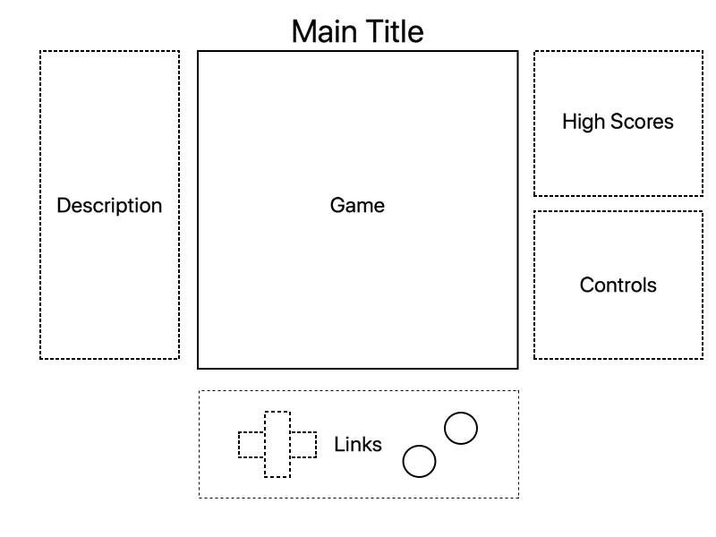

# Barrage

## Background
Barrage fits into the "bullet hell" genre of games, where a player moves forward automatically in a ship, constantly firing at waves of enemies, as a barrage of bullets fly back. 

The goal of the game is to collect orbs dropped by defeated enemies, while surviving to fight the level's boss. This often entails risky maneuvers, finding gaps just big enough to squeeze your ship through, as well as a number of powerups to make it managable along the way.

## MVPs
Users will be able to...
- Start, pause, and reset the game
- Move seamlessly 
- Destroy enemy ships
- Be destroyed by enemy fire or enemy ships
- Set a high score
- An about screen describing the rules of the game
- A production README

## Wireframe

## Technologies
* `JavaScript` for game logic
* `HTML5 Canvas` for effects rendering
* `Webpack` for bundle js files.

## Implementation Timeline
**Day 1**: Setup development environment, including webpack and `Canvas`. Write the basic architecture and files for the game. Learn the basics of `Canvas`. Goals for the day:
* Learn enough `Canvas` to render an object to the DOM.
**Day 2**: Become more proficient with `Canvas`, building out a ship and bullets. Goals for the day:
* Complete the ship.js module (constructor, movement and shooting functions)
**Day 3**: Build out simple enemy ships that fire and can cause a Game Over. Goals for the day:
* Be able to weave between bullets
* Have moving enemies.
* Implement a simple scoring system via destroyed enemies
**Day 4**: Polish a preset level 1 and the frontend design of the game. Goals for the day:
* Have a playable level
* Store high scores
* Create any modals and stylize links

## Bonus Features
* Add RPG leveling and more levels
* Add different difficulty modes
* Add various enemy types and bullet patterns