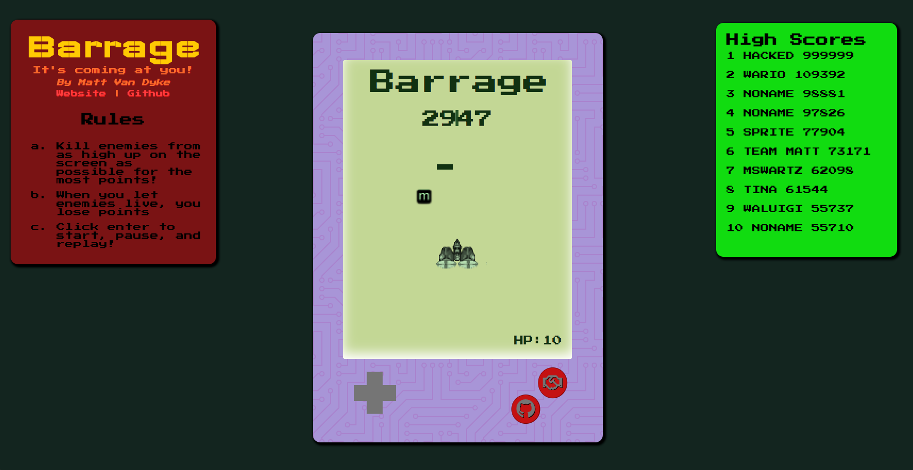

# Barrage

## Summary
[Barrage](http://mattvanlaw.io/barrage/) fits into the shoot-em-up genre of games, where a player moves a ship, constantly firing at waves of enemies, as a barrage of damage-dealing obstacles fly back. The goal of the game is to survive long enough to get the highest score, utilizing risky maneuvers, finding gaps just big enough to squeeze your ship through, and a number of powerups to make the swarm of baddies managable along the way.

## How to Play

Use the arrow keys to move. Press enter to start, pause, and replay. Kill enemies from as high up on the screen as possible for the most points, and grab powerups as they fall down. When you let enemies live, you lose points, so you have to destory as many as possible.

## Technologies
* `JavaScript` for game logic
* `HTML5 Canvas` for effects rendering
* `Webpack` for bundle js files.
* [`WisDOM`](https://github.com/MattVanLaw/WisDOM) my homebrew jQuery library
* `Google Firebase` for saving high scores

## Future Features
* Add RPG leveling and a level structure
* Add different difficulty modes
* Add various enemy types, bullet patterns, and mods